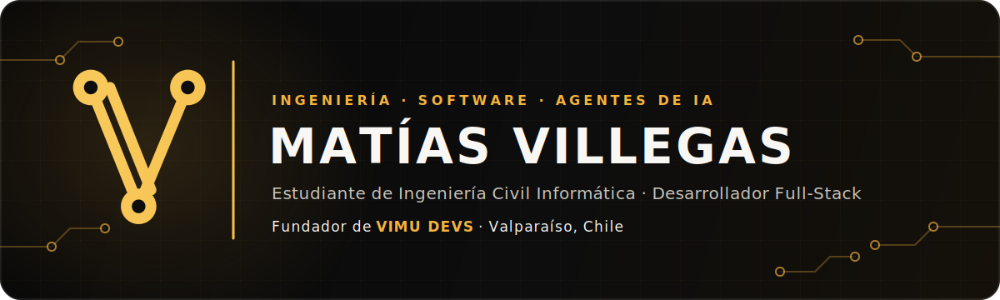
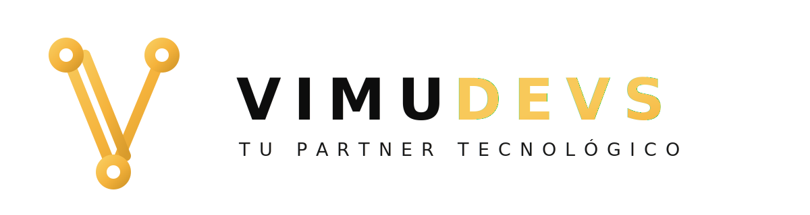

<div align="center">
  

  <a href="https://www.linkedin.com/in/matias-villegas-222a75284/"></a>
  <a href="mailto:matias.villegas.m@mail.pucv.cl"></a>
  <a href="mailto:matias.villegas.m@vimudevs.com"></a>
</div>

## Sobre mí

Soy estudiante de **Ingeniería Civil Informática en la Pontificia Universidad Católica de Valparaíso**, actualmente en la etapa final de la carrera.

Mi formación y experiencia se concentran en **ingeniería de software, desarrollo de aplicaciones web, ingeniería de requerimientos, bases de datos y gestión de proyectos informáticos**. Actualmente soy ayudante de **Ingeniería de Requerimientos** y anteriormente he apoyado asignaturas relacionadas con **Ingeniería Web y Aplicaciones Móviles**.

También soy fundador de **VIMU DEVS**, empresa chilena dedicada al desarrollo de software personalizado para organizaciones, empresas y pymes que necesitan digitalizar procesos o convertir ideas en soluciones tecnológicas funcionales.

## VIMU DEVS

<div align="center">
  <picture>
    <source media="(prefers-color-scheme: dark)" srcset="./assets/vimu-logo-dark.svg" />
    <source media="(prefers-color-scheme: light)" srcset="./assets/vimu-logo-light.svg" />
    
  </picture>
</div>

Como fundador participo en el levantamiento de requerimientos, diseño de soluciones, desarrollo full-stack, coordinación de proyectos y comunicación con clientes. La empresa busca transformar ideas, necesidades y procesos en soluciones digitales simples, modernas y mantenibles.

## Experiencia y proyectos recurrentes

<table>
  <tr>
    <td width="50%" valign="top">
      <h3>Plataforma LIMS</h3>
      <p><strong>Laboratorio de Asistencia Técnica PUCV</strong></p>
      <p>Plataforma orientada a digitalizar el flujo de muestras, la asignación de análisis, los formularios microbiológicos, los cálculos normativos, la validación y la generación de reportes.</p>
    </td>
    <td width="50%" valign="top">
      <h3>VitalHeart</h3>
      <p><strong>Gestión de espacios cardioprotegidos</strong></p>
      <p>Plataforma privada para administrar empresas, sedes, equipos DEA, mantenciones, documentos, alertas e indicadores de cumplimiento.</p>
    </td>
  </tr>
</table>

## Tecnologías con las que trabajo

<table>
  <tr>
    <td><strong>Frontend</strong></td>
    <td>
      
    </td>
  </tr>
  <tr>
    <td><strong>Backend</strong></td>
    <td>
      
    </td>
  </tr>
  <tr>
    <td><strong>Datos</strong></td>
    <td>
      
    </td>
  </tr>
  <tr>
    <td><strong>Infraestructura</strong></td>
    <td>
      
    </td>
  </tr>
</table>

## Desarrollo asistido por agentes de IA

Utilizo **[Gentle-AI](https://github.com/Gentleman-Programming/gentle-ai)** como ecosistema de desarrollo asistido por agentes. Mediante este entorno aplico **Spec-Driven Development (SDD)** y amplío el proceso con:

- **[Engram](https://github.com/Gentleman-Programming/engram)** como memoria persistente entre sesiones.
- Skills especializadas según la tecnología y el tipo de tarea.
- Modelos diferentes para exploración, diseño, implementación y verificación.
- Delegación en agentes especializados y preservación de las decisiones del proyecto.
- Revisión humana de requerimientos, arquitectura y resultados.

```text
Explorar → Especificar → Diseñar → Planificar → Implementar → Verificar
```

Trabajo principalmente con OpenCode, OpenAI Codex, Claude y Gemini como herramientas complementarias dentro de este proceso.

<table>
  <tr><td><strong>Ecosistema</strong></td><td>Gentle-AI</td></tr>
  <tr><td><strong>Memoria persistente</strong></td><td>Engram</td></tr>
  <tr><td><strong>Metodología</strong></td><td>Spec-Driven Development</td></tr>
  <tr><td><strong>Agentes y modelos</strong></td><td>OpenCode · OpenAI Codex · Claude · Gemini</td></tr>
</table>


> La inteligencia artificial me ayuda a ordenar, ejecutar y verificar ideas. La dirección, las decisiones y la responsabilidad de ingeniería siguen siendo humanas.

## Formación académica

**[Ingeniería Civil Informática — Pontificia Universidad Católica de Valparaíso](https://www.pucv.cl/pucv/pregrado/ingenieria-civil-informatica)**  
Etapa final de la carrera · Plan de estudios de 11 semestres

Áreas de interés: ingeniería de software, desarrollo web, ingeniería de requerimientos, bases de datos, gestión de proyectos y desarrollo asistido por agentes.

<details>
  <summary><strong>Ver actividad en GitHub</strong></summary>
  <br />
  <p align="center">
    
  </p>
</details>

---

<div align="center">
  <sub>
    Diseño inspirado en <a href="https://github.com/durgeshsamariya/awesome-github-profile-readme-templates">Awesome GitHub Profile README Templates</a>.
    Badges basados en <a href="https://github.com/Ileriayo/markdown-badges">Markdown Badges</a>.
  </sub>
</div>
